# Room Info

### Name: Pickle Rick
Description: This Rick and Morty-themed challenge requires you to exploit a web server and find three ingredients to help Rick make his potion and transform himself back into a human from a pickle.

Expected Time: 30 mins

Room Link: https://tryhackme.com/room/picklerick


# Steps to Hack & Notes for Blue Team
1. Opeing the homepage, we can see that we need to find the three missing ingredients:
   
2. Scan the port using Nmap, using http-enum NSE script to enumerate directories used by web servers.
  ```bash
  nmap -sV -p 80,443 --script http-enum 10.10.231.214
  ```
  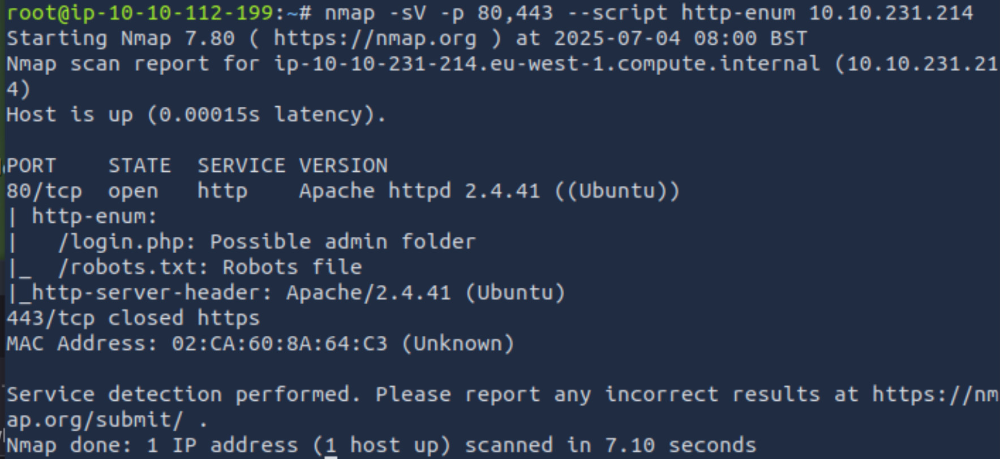
  As we can see, there is a login.php page:
  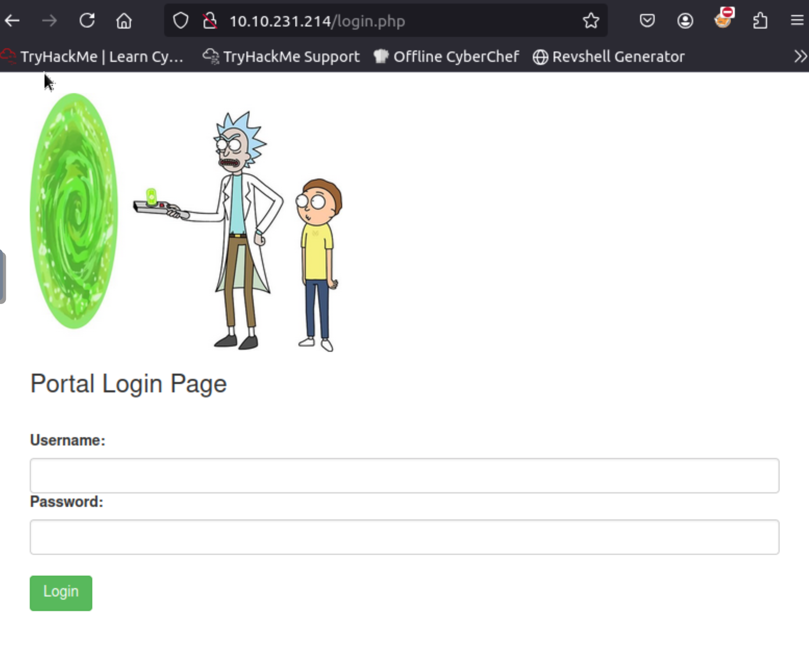
  and a robots.txt page:
  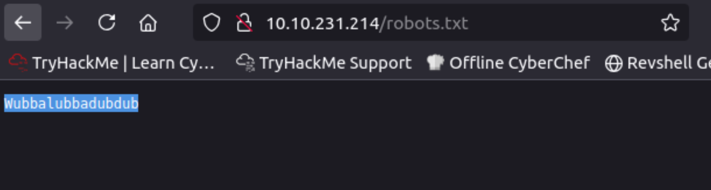

*BT Notes: To limit Nmap enumeration on an Apache web server (which the one that the site uses), programmers should disable directory listing through the .htaccess root file ([source](https://serverfault.com/questions/283758/how-can-i-prevent-people-from-looking-at-a-listing-of-files-in-parent-directory)). Additionally, they should implement a Web Application Firewall (WAF) such as ModSecurity and Cloudflare, as it can filter common HTTP-enum patterns ([source](https://serverfault.com/questions/283758/how-can-i-prevent-people-from-looking-at-a-listing-of-files-in-parent-directory)).*

3. The robots.txt page seems to contain the password. To find the username, we view the page source code of the home page with the shortcut Ctrl + U:
  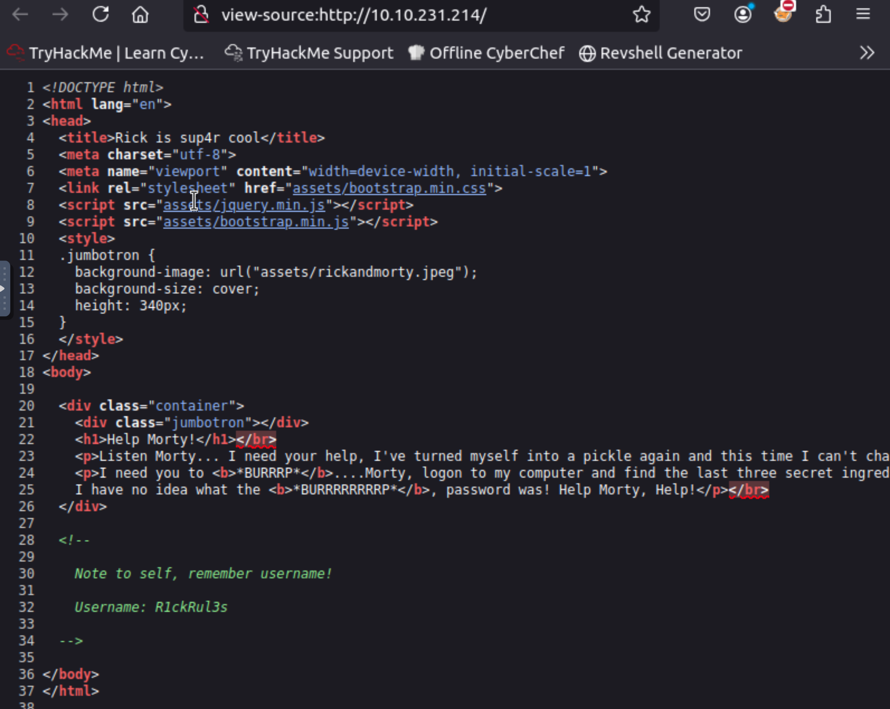

4. After entering the username and the password, we are directed to a portal page, which seems to be a Command Injection interface:
  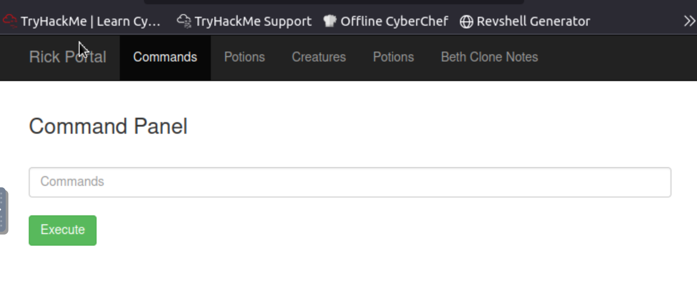
  All the tabs seem to be all be inaccessible:
  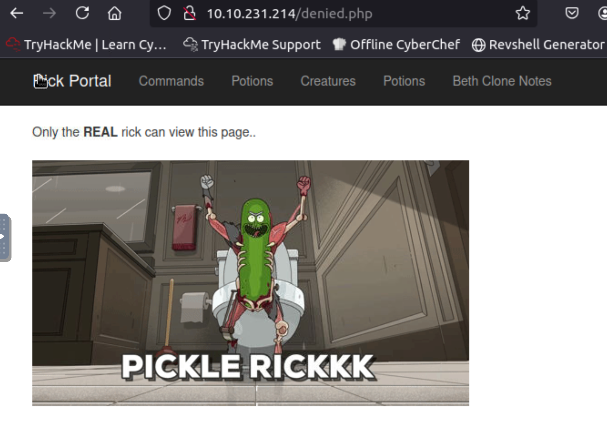

5. Using the command box, we can view all the files in the current directory:
  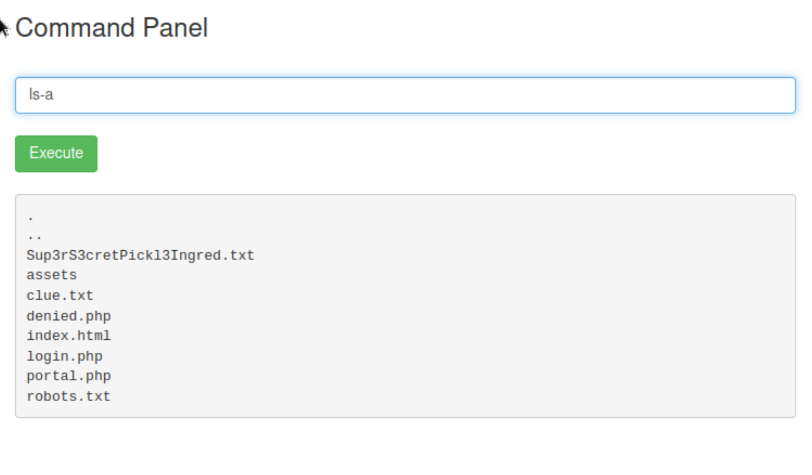

6. There is a very interestingly named text file, which seems to contain the first ingredient, and also clue.txt file. We tried to open the files with cat:
  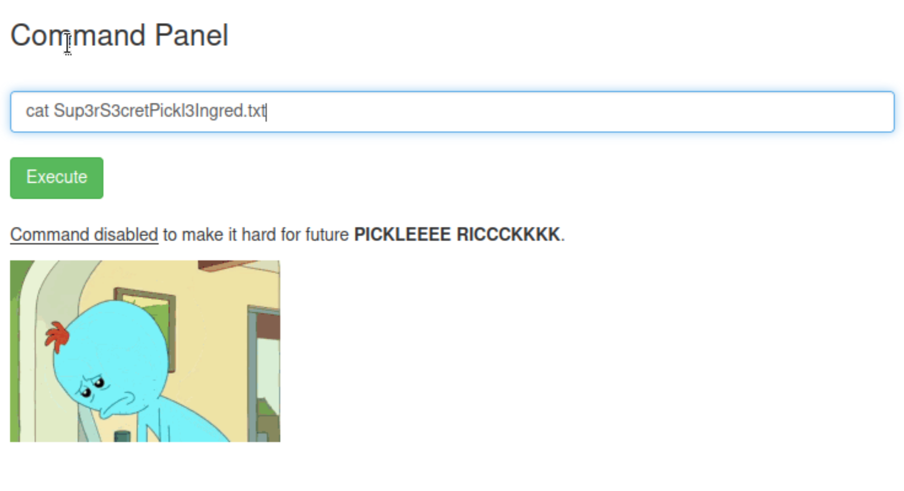
  However, it seems like the site blocks common displaying commands.

7. We tried using grep, which is a command-line utility for searching plaintext datasets for lines that match a regular expression, but by leaving the           regular expressions empty and including the -r (recursive) option, we can display everything in every file within the current directory. Luckily, this utility is not blocked:
  ```bash
  grep -r '' .
  ```
  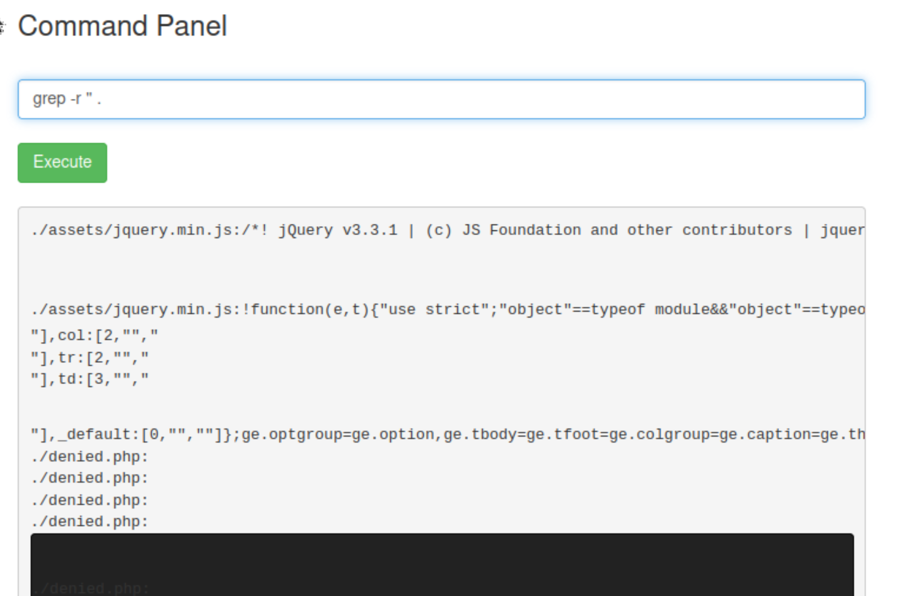
8. We scrolled down and see that the first ingredient is displayed. The clue.txt is also displayed, which tells us to explore the file system:  
   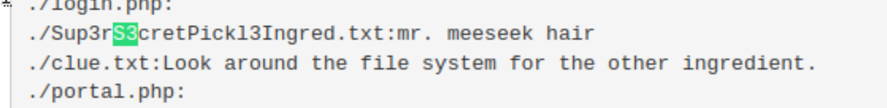

*BT Notes: There are various prevention methods for a Command Injection interface to make it harder for users to enumerate the system. For example, we can sanitize the user input, whitelisting safe commands ([source](https://snyk.io/blog/command-injection-python-prevention-examples/)). Additionally, we can also remove read and write permissions on important files within the Ubuntu system using the "chmod" command ([source](https://askubuntu.com/questions/1129479/removing-read-access-from-a-file)).*

9. We looked around the file system by backing away from the current directory, until we reached the top-level directory:
    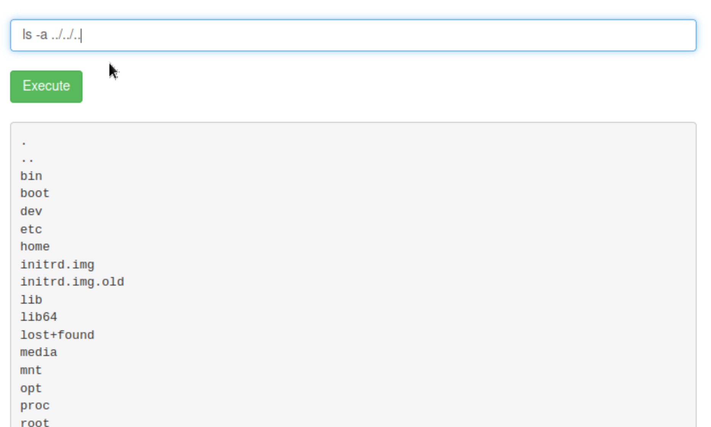

10. We tried looking for a .txt file in the whole directory to find any suspicious , but there were too many files to sort through, and none of them were interesting:

    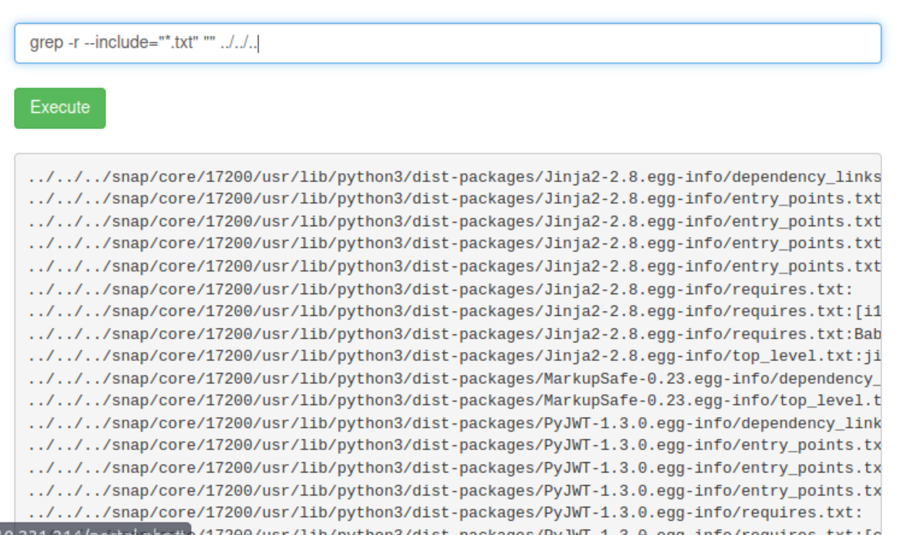

12. So we to find the second ingredient using the brute-force technique, using the find command:
    ```bash
     find ../../.. -type f \( -iname "*second*" -o -iname "*ingredient*" -o -iname "*2nd*" \)
     ```
    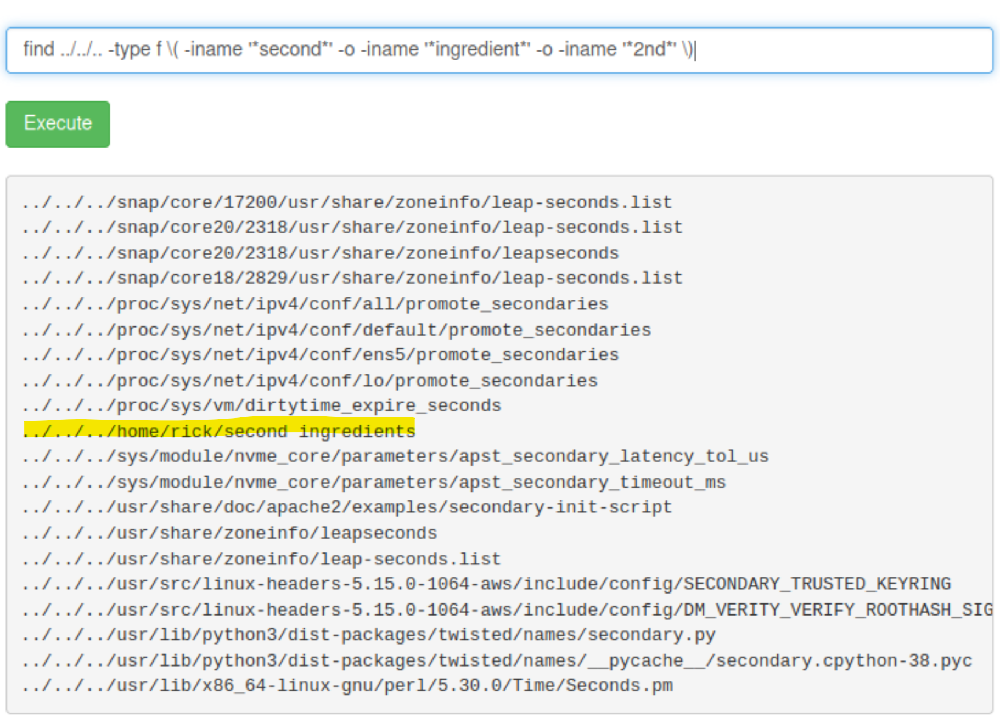

# Final Reflection
