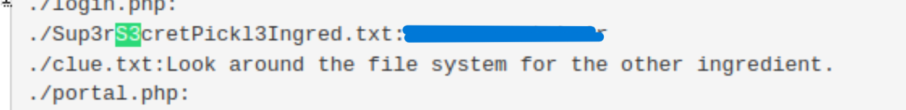

# Room Info

### Name: Pickle Rick
Description: This Rick and Morty-themed challenge requires you to exploit a web server and find three ingredients to help Rick make his potion and transform himself back into a human from a pickle.

Expected Time: 30 mins

Room Link: https://tryhackme.com/room/picklerick


# Steps to Hack & Notes for Blue Team
1. Opening the homepage, we can see that we need to find the three missing ingredients:
   
   
2. Scan the port using Nmap, using `http-enum` NSE script to enumerate directories used by web servers.
  ```bash
  nmap -sV -p 80,443 --script http-enum 10.10.231.214
  ```
  
  As we can see, there is a login.php page:
  
  and a robots.txt page:
  

*BT Notes: To limit Nmap enumeration on an Apache web server, which is the one that the site uses, programmers should disable directory listing through the `.htaccess` root file ([source](https://serverfault.com/questions/283758/how-can-i-prevent-people-from-looking-at-a-listing-of-files-in-parent-directory)). Additionally, they should implement a Web Application Firewall (WAF) such as ModSecurity and Cloudflare, as it can filter common HTTP-enum patterns ([source](https://serverfault.com/questions/283758/how-can-i-prevent-people-from-looking-at-a-listing-of-files-in-parent-directory)).*

3. The `robots.txt` page seems to contain the password. To find the username, we view the page source code of the home page with the shortcut `Ctrl + U`:
  

4. After entering the username and the password, we are directed to a portal page, which seems to be a Command Injection interface:
  
  All the tabs seem to all be inaccessible:
  

5. Using the command box, we can view all the files in the current directory:
  

6. There is a very interestingly named text file, which seems to contain the first ingredient, and also `clue.txt file`. We tried to open the files with `cat`:
  
  However, it seems like the site blocks common displaying commands.

7. We tried using `grep`, which is a command-line utility for searching plaintext datasets for lines that match a regular expression, but by leaving the           regular expressions empty and including the `-r` (recursive) option, we can display everything in every file within the current directory. Luckily, this utility is not blocked:
  ```bash
  grep -r '' .
  ```
  
  
8. We scrolled down and saw that the first ingredient is displayed. The clue.txt was also displayed, which tells us to explore the file system:
   

*BT Notes: There are various prevention methods for a Command Injection interface to make it harder for users to enumerate the system. For example, we can sanitize the user input, whitelisting safe commands ([source](https://snyk.io/blog/command-injection-python-prevention-examples/)). Additionally, we can also remove read and write permissions on important files within the Ubuntu system using `chmod` ([source](https://askubuntu.com/questions/1129479/removing-read-access-from-a-file)).*

9. We looked around the file system by backing away from the current directory until we reached the top-level directory:
    

10. We tried looking for a `.txt` file in the whole directory to find any suspicious titles, but there were too many files to sort through, and none of them were interesting:

    

11. So we tried to find the second ingredient using the brute-force technique, using the find command:
    ```bash
     find ../../.. -type f \( -iname "*second*" -o -iname "*ingredient*" -o -iname "*2nd*" \)
     ```
    

    Luckily, the "second ingredient" file is found.
12. Using `grep` again, we can display the content of the suspicious file, revealing the second ingredient we need:
    

*BT Notes: Brute-forcing attacks are very common in digital security, but they are also relatively easy to detect and mitigate. Other than blacklisting suspicious commands and avoiding the use of shell commands, users could also avoid using conventional names and passwords for important files. Furthermore, they can also implement stronger access control and authentication, introducing role-based access control and two-factor authentication for sensitive files ([source](https://blog.quttera.com/post/stop-directory-brute-forcing-attacks/)).*

13. After that, we tried to find the third and last ingredient by looking for files with the same file type as the second ingredient:
    

    Unfortunately, there seemingly were no other suspicious files that were written in ASCII text.
14. After some more trials and being stuck for a while, we realized that the file might be hidden in a privileged directory. Using the sudo command and the same brute-forcing technique, we found the last ingredient in the privileged `root` folder, which is, ironically, a `.txt` file:
    
    
    

15. Using the `sudo grep` command, we can display the third ingredient:
    

*BT Notes: Hiding sensitive files in privileged folders (like `/root`) is a good way to prevent normal shell commands from enumerating the system. However, it can easily be bypassed using the sudo command, and the files are still in plaintext when discovered. Therefore, users should blacklist sudo commands in their Command Injection interface and restrict certain users' privileges through the `/etc/sudoers` file ([source](https://www.digitalocean.com/community/tutorials/how-to-edit-the-sudoers-file)) . Additionally, they can encrypt sensitive files using the GnuPG tool. This tool uses asymmetric encryption, which only allows the recipient who has the private key to decrypt the messages ([source](https://nsrc.org/workshops/2016/renu-nsrc-cns/raw-attachment/wiki/Agenda/exercise-pgp-encryption.htm)).*

# Final Reflection
This is my first fully completed TryHackMe room and write-up. This room was quite a challenge, even though I did it twice so that I could take screenshots for this document. I think it was still pretty fun and humorous (there is a rabbit hole that I fell for in my first attempt in the page source code, but I didn't reveal where it is in here, because I don't want to spoil the fun), and it has taught me a lot of new techniques for system enumeration and command injections. I also discovered some neat prevention techniques, specifically for interfaces like this. Also, I used "we" in this document, just because it is my preference. The truth is that I am doing this all alone, unfortunately.
